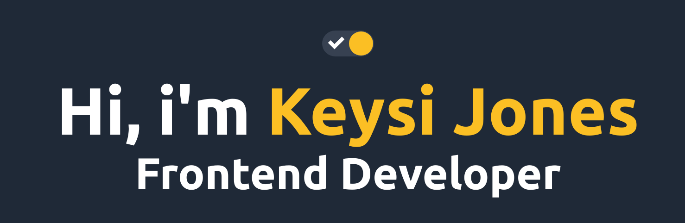

  

  
  
  </a>
  

 
<h3>About me</h3>
I'm a software engineer that likes to create beautiful
interfaces, innovate, help others, solve problems and make
people's lives easier. It's nice to meet you !
 
 
Areas of Expertise/Interest: Frontend Development, Backend Development (Node) and UI-UX Designing.

<h3>
  Skills 💼
</h3>
<h4>Programming Languages</h4>

  
  
    
      

<h4>Frontend Development</h4>

  
  
  
  

<h4>Backend Development</h4>

  
  
  
  
  

<h4>Tools & Technologies</h4>

  
  
  
  
  
  
    

<h3>
  Projects 👨‍💻
</h3>
<ul>
<li><a href="https://github.com/KeysiJones/my-blog">My personal tech blog</a></li>
  <li><a href="https://github.com/KeysiJones/KeysiJones">My Personal Portfolio</a></li>
  <li><a href="https://github.com/KeysiJones/jccarretos">JC Carretos | Landing page for my father's freight services</a></li>
    <li><a href="https://github.com/KeysiJones/Instipoa">Instipoa | Web app created to make access to religious institute classes easier</a></li>
    <li><a href="https://github.com/KeysiJones/instituto-admin">Instituto Admin | Web App created to administrate Instipoa's classes</a></li>
</ul>
<h3>
  GitHub Stats 📊
</h3>

  

### My personal portfolio

